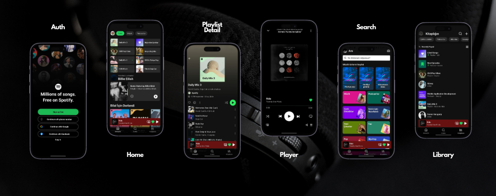
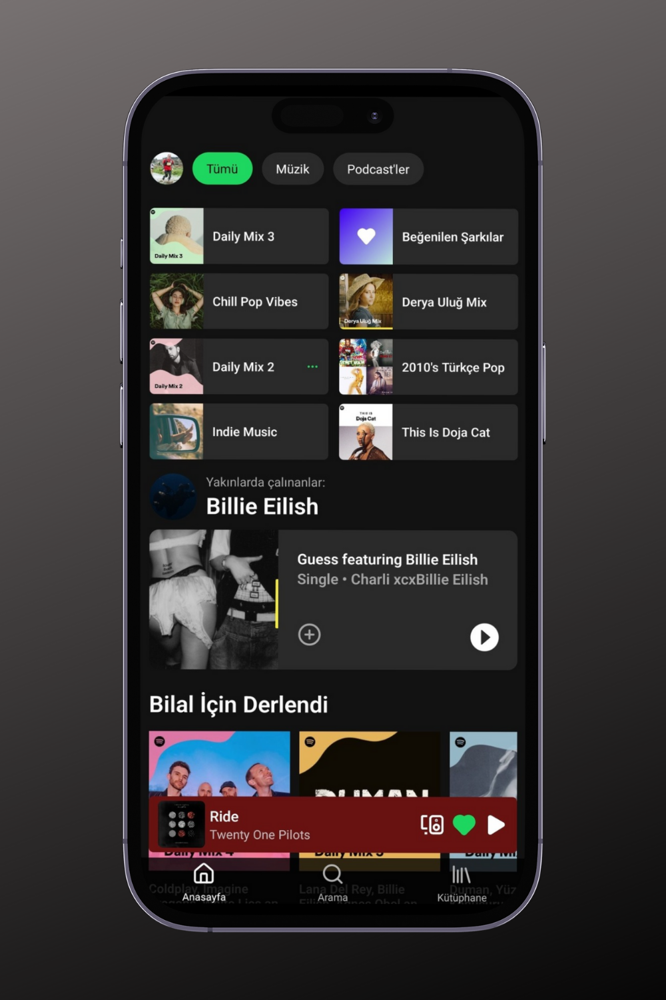
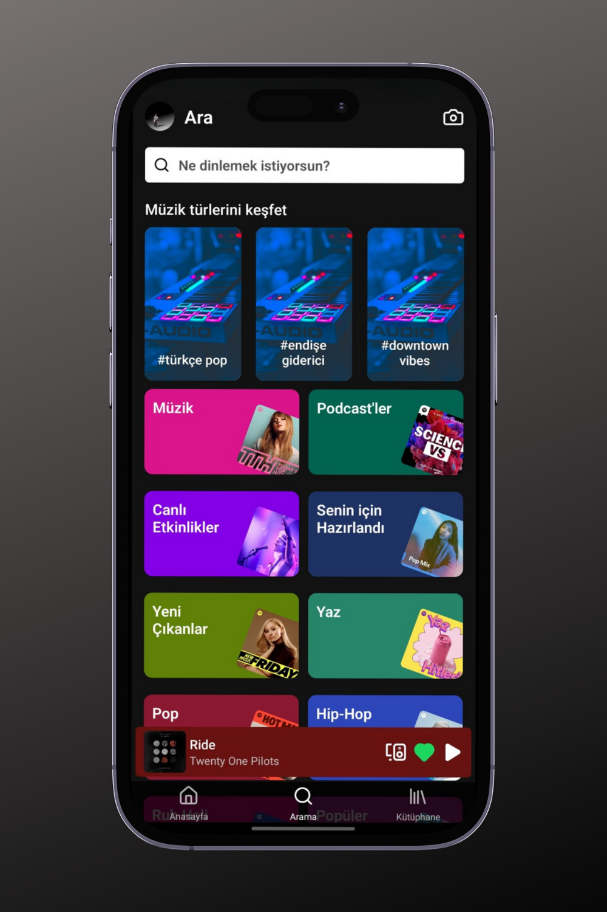
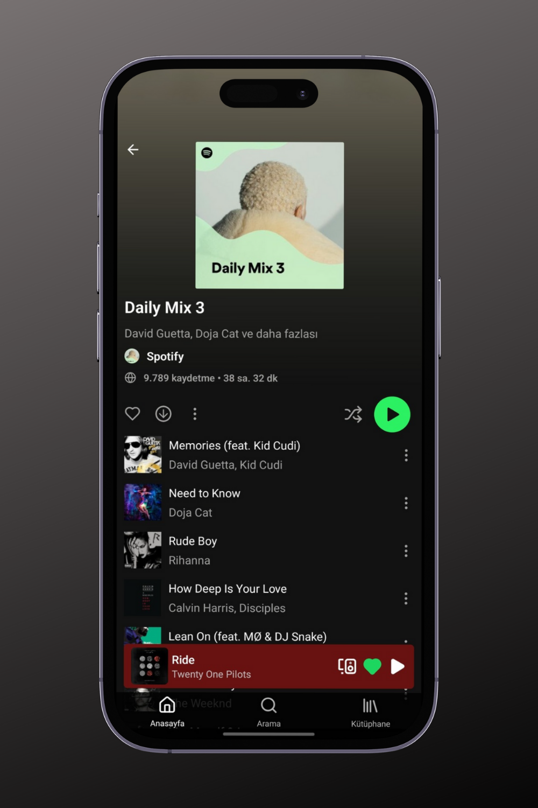
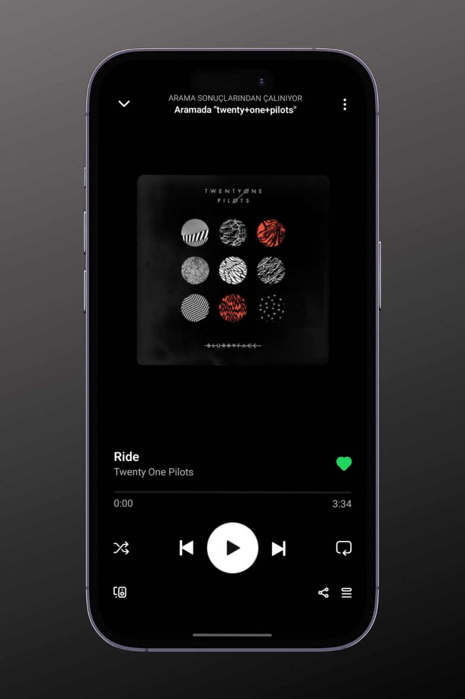
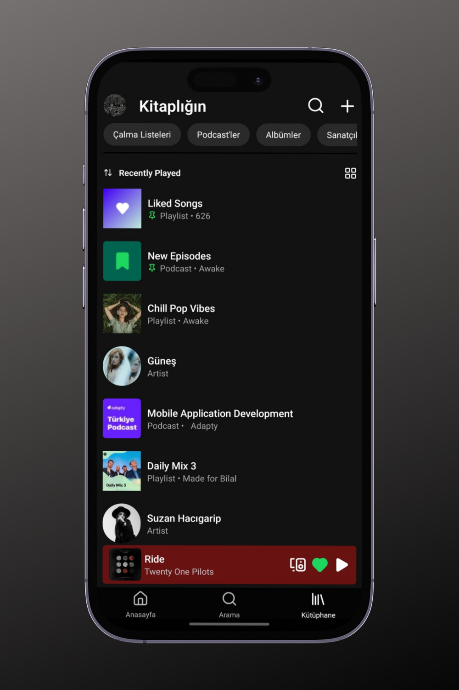

# Spotify Clone

This project aims to clone the design of the Spotify application using **React Native** and **Expo**. The main focus of the application is to replicate the user interface, without aiming to provide all functionalities of Spotify. It aims to offer a modern and aesthetic music player UI for mobile devices.

## Features

- Modern Spotify-like user interface
- Music player design
- Dynamic bottom menu (Bottom Tabs)
- Drawer menu navigation
- Responsive design
- Global state management with Redux Toolkit

## Installation

Follow these steps to run the project in your local environment:

### Requirements

- Node.js (v14 or higher)
- Expo CLI
- Android Studio or a physical Android device

### Steps

1. Clone this repository:

   ```bash
   git clone https://github.com/bilalseen/spotify-clone.git
   ```

2. Navigate to the project directory:

   ```bash
   cd spotify-clone
   ```

3. Install dependencies:

   ```bash
   npm install
   ```

4. Start the application:

   ```bash
   npm run android
   ```

> To run it on iOS:
>
> ```bash
> npm run ios
> ```

## Technologies Used

- **React Native**: For mobile app development
- **Expo**: For developing and testing React Native applications quickly
- **React Navigation**: For in-app navigation
  - `@react-navigation/bottom-tabs`: For bottom tab bar
  - `@react-navigation/drawer`: For drawer menu navigation
  - `@react-navigation/native` and `@react-navigation/stack`: For stack-based navigation
- **Redux Toolkit**: For state management
- **React Native Video**: For video playback component
- **React Native Gesture Handler**: For advanced touch and gesture handling
- **React Native Reanimated**: For animations and transitions
- **Lucide React Native**: For icon sets
- **Expo Linear Gradient**: For linear gradient effects

## Screenshots



<!-- <div style="text-align: center;">
  <table style="margin: 0 auto;">
    <tr>
      <th style="text-align: center;">Authentication</th>
      <th style="text-align: center;">Home</th>
      <th style="text-align: center;">Search</th>
    </tr>
    <tr>
      <td style="text-align: center;">
        
      </td>
      <td style="text-align: center;">
        
      </td>
      <td style="text-align: center;">
        
      </td>
      </tr>
      <tr>
       <th style="text-align: center;">Playlist Detail</th>
      <th style="text-align: center;">Player Detail</th>
      <th style="text-align: center;">Library</th>
      </tr>
      <tr>
      <td style="text-align: center;">
        
      </td>
      <td style="text-align: center;">
        
      </td>
      <td style="text-align: center;">
        
      </td>
    </tr>
  </table>
</div> -->

## Project Structure

- `src/`: Main source code
- `components/`: Reusable components
- `screens/`: Different screens and pages
- `redux/`: Store, slices, and reducers using Redux Toolkit
- `assets/`: Images and static files


## License

This project is licensed under the MIT License - see the LICENSE file for details.
